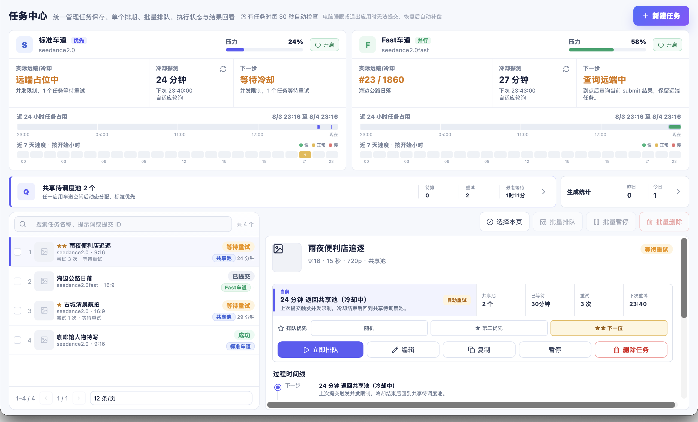
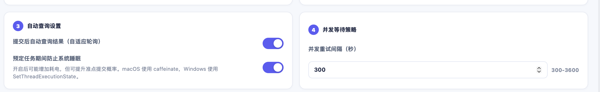

<h1 align="center">Dreamina Scheduler</h1>

<p align="center">
  <strong>让即梦视频任务持续排队，空出并发就自动补上。</strong><br>
  基于 Tauri 的 Dreamina CLI 桌面调度器：批量入队、并发等待、自动重试、结果轮询，一次配置后持续推进。
</p>

<p align="center">
  
  
  
  
  
</p>

<p align="center">
  <a href="#快速开始">快速开始</a> ·
  <a href="#不间断排队是怎么工作的">工作原理</a> ·
  <a href="#核心功能">核心功能</a> ·
  <a href="#运行边界">运行边界</a>
</p>



## 为什么需要它

Dreamina CLI 很适合提交单个任务；连续生产时，真正消耗精力的是提交之后：

- 并发已满，要反复等待并重新执行命令；
- `submit_id` 越积越多，要逐个查询生成状态；
- 多个任务需要手动判断先后、模型和下一次尝试时间；
- 角色图片、音频和临时参考图散落在不同路径。

Dreamina Scheduler 在 CLI 之上增加一个本地桌面调度层。任务只需进入队列，应用会持续寻找可用车道，处理可恢复错误，跟踪远端状态，并在当前任务释放后继续推进下一项。

## 不间断排队是怎么工作的

```text
创建 / 批量选择任务
        ↓
进入共享待调度池
        ↓
选择可用的标准 / Fast 车道
        ↓
并发已满 ──→ 冷却等待 ──→ 自动重试
        ↓
提交成功 ──→ 自适应查询 ──→ 保存结果
        ↓
释放车道，继续推进下一项
```

排队不是简单的定时循环：

- **持续补位**：有任务时调度器每 30 秒检查一次；车道释放后继续处理等待任务。
- **并发友好**：识别 `ConcurrencyLimit`，进入冷却并按策略重试，不要求人工反复执行命令。
- **双车道调度**：共享池统一承接待提交任务，由标准 / Fast 车道的实时状态决定下一步。
- **自动追踪**：提交成功后保存 `submit_id`，根据远端排位和状态继续查询，直到成功、失败或停止追踪。
- **可恢复运行**：任务和执行记录保存在本地；应用重启后可继续处理尚未完成的队列。
- **防自动睡眠**：任务活跃期间可阻止系统自动睡眠，提高长时间与夜间排队的连续性。

## 核心功能

| 能力 | 解决的问题 |
| --- | --- |
| 不间断任务队列 | 批量任务进入共享池，空出车道后自动推进 |
| 标准 / Fast 双车道 | 同时观察两条远端通道，按可用状态调度 |
| 自动重试 | 并发限制、网络不可用和部分瞬时错误无需手动重跑 |
| 自动查询 | 持续跟踪远端排位、生成状态和结果地址 |
| 优先级控制 | 支持随机、第二优先和下一位，临时插队无需重建任务 |
| 任务时间线 | 记录入队、提交、查询、重试、失败与完成的关键节点 |
| 角色与素材库 | 集中管理角色图、音频和临时素材，Prompt 中用 `@` 引用 |
| 本地持久化 | 保留任务、执行记录、结果入口和调度设置 |

### 队列状态一眼可见

任务中心集中展示标准 / Fast 车道压力、远端占位、冷却时间、共享池和所选任务的下一步动作。排队中的任务可以调整优先级、暂停或重新排队。

### 自动查询、自动重试与防睡眠



设置页可以开启自适应结果查询和任务期间防自动睡眠，并配置并发重试间隔。macOS 使用 `caffeinate`，Windows 使用 `SetThreadExecutionState`。

## 快速开始

### 前置要求

- Node.js 18 或更高版本
- Rust 工具链
- 已安装并登录的 Dreamina CLI（也可以在应用设置页触发安装与登录）

### 开发模式

```bash
git clone https://github.com/guuguo/dreamina-scheduler.git
cd dreamina-scheduler
npm install
npm run tauri:dev
```

### 构建桌面应用

```bash
npm run tauri:build
```

macOS 构建产物位于 `src-tauri/target/release/bundle/`。项目脚本以 `package.json` 为准，当前使用 `tauri:dev` 与 `tauri:build`。

## 使用流程

1. 打开 **设置**，检测或安装 Dreamina CLI，并完成登录。
2. 在 **角色库** 导入常用角色图片和音频；也可以直接使用临时素材。
3. 在 **新建任务** 中填写 Prompt，通过 `@角色` / `@图片N` 引用素材。
4. 保存多个任务，在 **任务中心** 单个排队或批量排队，并按需设置开始时间与间隔。
5. 保持应用运行。调度器会处理并发等待、重试和结果查询；在任务中心查看时间线与结果。

## 与 Dreamina CLI 的关系

| 维度 | Dreamina CLI | Dreamina Scheduler |
| --- | --- | --- |
| 单次提交 | 直接、轻量 | 图形化创建与预览参数 |
| 批量任务 | 自己编写循环脚本 | 共享待调度池与批量排队 |
| 并发限制 | 手动等待、重新执行 | 自动冷却与重试 |
| 结果查询 | 手动保存和查询 `submit_id` | 自适应轮询与时间线 |
| 素材管理 | 手动维护文件路径 | 角色库、拖拽导入和 `@` 引用 |
| 长时间运行 | 自己维护进程 | 桌面调度与防自动睡眠 |

Scheduler 不替代 Dreamina CLI。CLI 仍是底层执行引擎，Scheduler 负责本地编排、状态持久化与可视化。

## 运行边界

这里的“不间断”指：**应用保持运行时，调度器会持续照看未完成任务，并可阻止系统自动睡眠。**

- 退出应用后不会在后台继续提交或查询；重新打开后可从本地状态继续。
- 关机、应用崩溃、手动强制睡眠和系统断网期间无法推进任务。
- 防自动睡眠目前支持 macOS 和 Windows；Linux 尚未实现对应能力。
- 当前主要支持 `multimodal2video`，视频输入素材和更多任务类型仍在规划中。
- Windows CLI 一键安装命令尚未确认官方默认源，可在设置页手动填写。

## 开发与贡献

欢迎提交 Issue 和 Pull Request。提交前请运行：

```bash
npm test
npm run build
```

涉及 Tauri / Rust 的改动还应验证：

```bash
npm run tauri:build
```

请避免提交真实 API Key、个人素材、任务数据库或包含隐私信息的截图。

## Roadmap

- [ ] 下载目录配置与结果一键打开
- [ ] 视频素材支持
- [ ] 更多 Dreamina 任务类型
- [ ] CLI 实时日志流与登录引导增强
- [ ] Windows CLI 一键安装

## License

MIT
