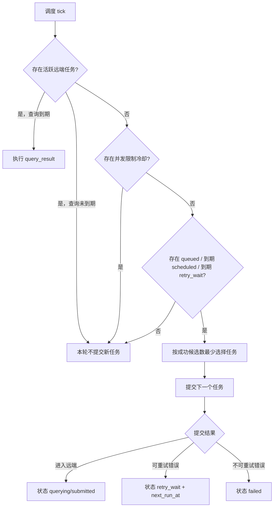

# 一、修改历史

| 版本 | 变更日期 | 变更人 | 变更内容 |
| --- | --- | --- | --- |
| v0.1 | 2026-06-18 | Codex | 初稿：仪表盘/脚本清理、可重试提交错误、连续排队调度方案 |
| v0.2 | 2026-06-18 | Codex | 补充同任务多次提交与公平调度方案 |
| v0.3 | 2026-06-18 | Codex | 收敛为最小方案：只新增目标成功候选数，移除时间窗截止和轮次计数字段 |
| v0.4 | 2026-06-18 | Codex | 更新落地状态与验证结果 |

# 二、项目背景

**PRD：** 暂无，来自本次需求讨论。

**接口文档：** 暂无，依赖现有 Dreamina CLI `multimodal2video` / `query_result` 输出。

**背景说明：**
当前应用已经以“任务中心”为主界面，但仓库内仍残留仪表盘、README 自动截图模式和一次性排查脚本。任务调度方面，批量排布会按固定时间间隔写入计划时间，导致上一个视频任务提前完成后，下一个任务仍要等预设时间点，无法利用中间空档。提交阶段还会遇到 `ApplyImageUpload ... EOF` 这类平台上传瞬时错误，当前容易直接失败。视频生成也存在“抽卡”诉求：同一个任务希望生成多个成功候选结果，但不能让一个任务连续占满队列。

**目标：**
- 清理仪表盘、自动截图链路、截图资源和未登记的一次性脚本。
- 将“批量固定间隔排期”补充为“连续排队”，让任务在开始时间后完成一个马上接下一个。
- 支持同一个任务设置目标成功候选数，用于生成多个结果。
- 多次提交按成功候选数公平执行：成功数少的任务优先，避免单任务抽卡耗尽其他任务时间。
- 将并发限制、图片上传 EOF、网络超时等可恢复错误纳入自动重试。
- 避免本地仍有活跃远端任务时继续提交下一条任务，减少主动撞 `ExceedConcurrencyLimit`。

**非目标：**
- 不实现多并发提交；本地仍保持单飞行任务。
- 不引入独立数据库、队列表、队列组、优先级或复杂状态机。
- 不做“最晚截止时间/时间窗截止”。
- 不改 Dreamina CLI 本身，不假设 CLI 一定能返回更精确的远端 ETA。

# 三、需求细分

| 需求点 | 说明 | 优先级 | 依赖/约束 | 验收口径 |
| --- | --- | --- | --- | --- |
| 仪表盘残留清理 | 清理 dashboard/仪表盘文案、截图资源、测试语义和自动截图 fixture | P0 | 任务中心统计卡片仍在使用，不能误删 | 全仓不再有运行态 dashboard 入口和 README 自动截图模式 |
| 遗留脚本清理 | 删除未被 package scripts、CI 或应用运行调用的一次性排查脚本 | P0 | 不删除构建、测试、Tauri 必要入口 | `scripts/` 不再保留未登记的临时调试脚本 |
| 可重试提交错误 | `ExceedConcurrencyLimit`、`ApplyImageUpload ... EOF`、网络超时进入 `retry_wait` | P0 | 重试间隔复用设置项，建议默认 10 分钟 | 上传 EOF 时任务不直接终态失败，而是等待重试 |
| 连续排队 | 批量任务可共享同一开始时间，进入队列后顺序提交 | P0 | 本地仍只能同时提交/查询一个远端任务 | 第一个任务终态后，下一条到期任务在下一 tick 接上 |
| 同任务多次提交 | 单个任务可设置目标成功候选数 | P0 | 成功数量从 `execution_records` 推导，不复制任务 | 目标成功数为 3 后，最终至少有 3 条成功执行记录 |
| 公平调度 | 多次提交任务不能连续跑完所有次数，应优先补齐成功数更少的任务 | P0 | 调度器按“成功候选数 + 队列顺序”选择 | A=3、B=1、C=2 且都成功时，顺序为 A1、B1、C1、A2、C2、A3 |
| 远端排队感知 | 若 CLI 查询返回 `queue_info`，继续展示排队位置 | P1 | CLI 不一定返回 ETA | UI 展示已有队列位置；无数据时按退避/重试策略等待 |

# 四、方案设计

## 1. 方案一(主)

### 方案概述

本次采用“清理残留 + 增强调度核心”的最小方案。清理侧删除仪表盘、自动截图模式和一次性脚本残留；调度侧不新增任务系统，而是在现有任务状态、`scheduled_at`、`next_run_at`、`retry_wait` 和执行记录基础上补齐连续排队能力。

核心思路：
- 批量排队默认允许多个任务共享同一个“最早开始时间”。
- 任务只新增 `planned_submit_count`，表示目标成功候选数。
- 已成功候选数从 `execution_records.status == "succeeded"` 推导，不新增 started/completed/round 字段。
- 调度 tick 先处理当前活跃远端任务；如果查询未到退避时间，本轮不提交新任务。
- 没有活跃远端任务时，才选择下一个可提交任务。
- 任务选择按成功候选数公平：先选成功数最少的任务，同成功数内按队列顺序/创建时间执行。
- `ExceedConcurrencyLimit` 视为全局远端坑位占用，整队冷却等待；上传 EOF、timeout、5xx 只让当前任务进入 `retry_wait`。
- 计划任务因提交阶段瞬时错误连续重试 3 次后先标为 `failed`，不继续阻塞后续正常任务；当队列没有其他到期任务时，再把这类 `failed` 任务按重试间隔捞起，最多额外补试 3 次。空闲补试每次只提交一次，失败后继续保持 `failed`，避免重新进入普通 `retry_wait` 抢队列。

### 方案取舍与最小化说明

只把批量间隔改成 0 可以减少一部分空档，但不能阻止“远端任务还在跑，本地继续提交下一条”导致的并发错误，也不能处理上传 EOF 直接失败。因此本期必须同时修改调度阻塞条件、错误分类和任务选择策略。

不采用新增队列表、队列组、轮次字段、截止时间窗或 ETA 预测。当前核心问题来自选择策略和错误分类，现有 JSON 状态模型已经足够表达本期行为。

### 系统影响范围

| 影响对象 | 类型 | 影响方式 | 具体变化 | 兼容/迁移策略 | 验证方式 | 风险等级 |
| --- | --- | --- | --- | --- | --- | --- |
| 任务中心 | 页面/交互 | 修改 | 批量排布增加连续排队语义，支持目标成功候选数设置 | 旧单任务排期继续保留 | 前端单测 + 手工验证 | 中 |
| 调度核心 | 任务 | 修改 | 活跃任务未结束时阻止新提交；查询到期优先查询 | 旧状态照常读取 | Rust 单测 | 高 |
| 多次提交计划 | 数据/任务 | 新增 | 任务增加目标成功候选数字段，成功数量从执行记录推导 | 旧任务默认 1 次 | Rust 单测 + UI 回归 | 高 |
| 错误分类 | 模块 | 修改 | 上传 EOF、ImageX apply 阶段错误归入可重试瞬时错误 | 保留最终失败上限 | Rust 单测 | 中 |
| README/截图模式 | 文档/代码 | 删除 | 删除截图资源、自动截图 fixture 和 readme-screenshot 分支 | 不影响运行功能 | `rg` + 前端测试 | 低 |
| scripts 目录 | 脚本 | 删除 | 删除未登记的一次性调试脚本 | 后续排查优先走日志中心 | `rg` + package scripts 检查 | 中 |

### 代码仓库改动清单

| 代码仓库/工程 | 所属系统/应用 | 改动模块 | 改动类型 | 主要改动 | 发布顺序 | 验证方式 |
| --- | --- | --- | --- | --- | --- | --- |
| dreamina-scheduler | Tauri 桌面应用 | 前端任务中心/README/脚本 | 修改/删除 | 清理截图模式；调整批量排队与多次提交交互 | 第 1 步 | `npm test` |
| dreamina-scheduler | Tauri 桌面应用 | Rust 调度与错误分类 | 修改 | 活跃任务阻塞、成功数公平选择、新增可重试错误 | 第 2 步 | `cargo test` |

### 流程设计



### 模型设计

本项目使用本地 JSON 状态，不涉及数据库 DDL。本期只新增一个字段：

| 模型 | 字段 | 类型 | 默认值 | 说明 |
| --- | --- | --- | --- | --- |
| ScheduledTask | `planned_submit_count` | `u32` | `1` | 该任务希望获得的成功候选数，用于抽卡 |

兼容策略：
- 旧数据无 `planned_submit_count` 时按 1 处理。
- 已成功候选数从 `execution_records.status == "succeeded"` 推导。
- `成功候选数 >= planned_submit_count` 时，任务进入 `succeeded` 终态。
- 单次提交或查询成功后，如果成功候选数仍小于目标值，顶层任务回到 `queued` 等待下一轮公平选择。
- 可重试的预提交失败进入 `retry_wait`，不增加成功候选数；非成功执行记录只作为排查历史。

### 重点难点与伪代码

```java
public class SchedulerTickService {

    public Optional<Task> processTick(AppData data, Instant now) {
        Optional<Task> active = data.findActiveRemoteTask();
        if (active.isPresent()) {
            Task task = active.get();
            if (task.isQueryDue(now)) {
                return Optional.of(queryResult(task));
            }
            return Optional.empty();
        }

        if (data.hasConcurrencyCooldown(now)) {
            return Optional.empty();
        }

        Optional<Task> due = data.findNextDueSubmitTask(now);
        if (!due.isPresent()) {
            return Optional.empty();
        }

        SubmitResult result = submit(due.get());
        if (result.isRetryable()) {
            due.get().markRetryWait(result.nextRetryAt());
        }
        return Optional.of(due.get());
    }

    public Optional<Task> findNextDueSubmitTask(List<Task> tasks, Instant now) {
        return tasks.stream()
            .filter(task -> task.successfulExecutionCount() < task.getPlannedSubmitCount())
            .filter(task -> task.isDue(now))
            .sorted(Comparator
                .comparing(Task::successfulExecutionCount)
                .thenComparing(Task::getQueuePosition)
                .thenComparing(Task::getCreatedAt))
            .findFirst();
    }
}
```

### 接口设计

不新增外部 HTTP/RPC 接口。Tauri 命令保持轻量扩展：

```plaintext
1. set_task_planned_submit_count_command
   param:
     task_id string true 任务 ID
     planned_submit_count number true 目标成功候选数，建议 UI 限制 1-10
   result:
     ScheduledTask

2. reschedule_task_command
   param:
     task_id string true 任务 ID
     new_scheduled_at string true 最早开始时间，空字符串表示取消排期
   result:
     ScheduledTask

3. process_queue_command
   param:
     none
   result:
     ScheduledTask | null
```

### 幂等、并发与一致性

- 本地通过既有 `PROCESS_QUEUE_RUNNING` 保证同一进程内单个调度 tick 执行。
- 存在 `submitting/querying/submitted` 且未自动停止查询的活跃任务时，不提交下一条。
- `ExceedConcurrencyLimit` 触发整队冷却；冷却状态从导致并发限制的任务 `retry_wait + next_run_at + last_error` 推导，不新增全局字段。
- 上传 EOF、timeout、5xx 只影响当前任务，下一 tick 可尝试其他任务。
- 因提交瞬时错误失败的任务作为空闲补试候选：普通 `queued/scheduled/retry_wait` 任务优先，候选为空时才补试 `failed + Transient` 的任务。
- 多次提交不并发执行；同一任务每次执行都必须等上一条远端任务终态后再进入下一轮选择。
- 公平性规则：成功候选数最少的任务优先，同成功数按队列顺序/创建时间排序。
- 可重试失败不增加成功候选数，避免一次并发限制或上传 EOF 消耗抽卡次数。
- 不可重试失败进入 `failed`，需用户手动恢复或重新排期，避免坏任务无限自动占队。
- 提交阶段返回 `gen_status=fail` 且带疑似无效 `submit_id` 时，不将该 `submit_id` 作为当前可查询任务；可保存在执行记录中用于审计。

### 原有逻辑兼容

- 旧任务状态继续兼容：`draft/queued/scheduled/retry_wait/submitting/submitted/querying/succeeded/failed/paused`。
- 旧批量排布保留固定间隔选项，但默认推荐“连续排队”。
- 旧执行记录展示继续可用。
- 旧任务默认目标成功候选数为 1，不改变原有单次任务行为。
- 已完成旧任务重新抽卡时，目标成功候选数与历史成功记录一起计算；如果历史已有 1 条成功，设置为 3 表示再补 2 条成功候选。

### 方案优缺点与取舍

| 方案 | 优点 | 缺点 | 结论 |
| --- | --- | --- | --- |
| 主方案：现有状态模型上增强连续排队 | 改动小、兼容旧数据、能解决空档和重试问题 | 不支持复杂队列组和截止时间窗 | 推荐 |
| 多次提交拆成多个任务副本 | 调度实现简单 | 任务列表膨胀，难以聚合比较同一 prompt 的多个候选结果 | 不采用 |
| 单任务连续跑完所有抽卡次数 | 实现简单 | 不公平，会耗尽其他排队任务的可用时间 | 不采用 |
| 新增完整队列表/队列组 | 表达能力强 | 改动大，当前收益不足 | 不采用 |

# 五、人力安排

| 目标 | 内容 | 时间安排 | 负责人 |
| --- | --- | --- | --- |
| 清理残留 | 仪表盘、自动截图模式、遗留脚本、README 相关引用 | 2026-06-18 已完成 | Codex |
| 调度修复 | 活跃任务阻塞、连续排队、多次提交公平调度、错误分类 | 2026-06-18 已完成 | Codex |
| 验证 | 前端单测、Rust 单测、构建与残留扫描 | 2026-06-18 已完成 | Codex |

# 六、测试方案

| 测试类型 | 测试重点 | 覆盖范围 |
| --- | --- | --- |
| 前端单元测试 | 批量连续排队计划、目标成功候选数输入、截图模式残留断言 | schedule-utils、app-logic、源码契约测试 |
| Rust 单元测试 | 活跃任务未到查询退避时不提交下一条；查询到期优先查询；成功数公平选择 | 调度核心 |
| Rust 错误分类测试 | `ExceedConcurrencyLimit`、`ApplyImageUpload EOF`、timeout 进入 `retry_wait` | 错误分类与提交写回 |
| 回归测试 | 单任务立即提交、定时提交、多次提交、手动查询、历史执行记录展示 | 任务中心主链路 |
| 人工验证 | 创建 A=3、B=1、C=2 三个连续排队任务，验证成功场景按 A1、B1、C1、A2、C2、A3 推进 | 本地 App + mock/真实 CLI |

# 七、上线方案

单仓库本地应用发布，无跨系统发布顺序。

## 上线ToDo

- [x] 删除 dashboard/自动截图/遗留脚本残留后执行全仓 `rg` 检查。
- [x] 新增/更新前端与 Rust 单测。
- [x] 验证同任务多次提交的执行记录、结果展示和公平顺序。
- [x] 执行 `npm test`。
- [x] 执行 `cargo test`。
- [x] 执行 `npm run build`。

## 上线观察项

| 观察项 | 指标/日志 | 预期 | 异常处理 |
| --- | --- | --- | --- |
| 连续排队接棒 | 调度日志 `queue.execute` | 活跃任务结束后下一 tick 提交下一条 | 检查是否仍有活跃任务阻塞 |
| 多次提交公平性 | 执行记录成功数 / 调度日志 | 先补齐成功数更少的任务 | 检查任务选择排序 |
| 可重试错误 | 任务 `last_error` / `retry_wait` | 上传 EOF、connection reset 和并发限制进入等待重试；提交阶段瞬时错误连续重试 3 次仍失败后挂起，队列空闲时最多额外补试 3 次 | 调整错误分类关键词或重试间隔 |
| 截图残留 | `rg dashboard/readme-screenshot/capture-readme` | 运行代码无残留 | 删除或更新残留引用 |

# 八、运维方案

本地桌面应用不涉及线上告警。本期需要保留足够日志：
- 调度 tick：记录 started、skipped_busy、no_due_task、execute。
- 多次提交：记录任务标题、目标成功候选数、当前成功候选数。
- 重试原因：记录错误分类、下一次重试时间、重试次数；计划任务提交阶段的上传 EOF、connection reset、broken pipe、timeout 等瞬时错误最多自动重试 3 次，仍失败后置为 `failed`。

若用户需要排查历史 state，优先在日志中心展示和导出，不再依赖散落在 `scripts/` 下的一次性脚本。

# 九、问题记录

| 问题 | 当前判断/推荐答案 | 状态 | 负责人 |
| --- | --- | --- | --- |
| `planned_submit_count` 表示什么 | 表示目标成功候选数；失败和可重试错误不计数 | 已确认 | 待定 |
| 是否做最晚截止时间 | 首版不做，避免引入额外状态和边界 | 已确认 | 待定 |
| 是否新增轮次/started/completed 字段 | 不新增，从执行记录推导成功数 | 已确认 | 待定 |
| `ExceedConcurrencyLimit` 后是否换任务继续撞 | 不换任务，视为远端全局坑位占用，整队冷却 | 已确认 | 待定 |
| 默认重试间隔 | 复用设置页字段，不新增硬编码；用户可调整为 10 分钟 | 已确认 | Codex |
| CLI 是否能稳定返回 `queue_info` | 现有解析已支持，但不能假设一定返回；无返回时按退避/重试策略处理 | 待确认 | 待定 |
